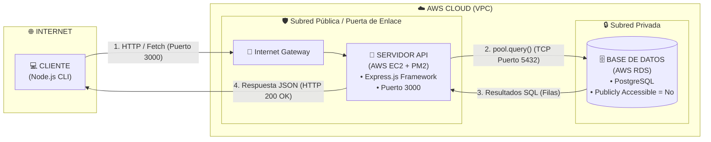

# TODO Manager - Architecture & AWS Cloud Deployment

Un sistema gestor de tareas desarrollado con **Node.js**, **Express** y **PostgreSQL** utilizando la arquitectura en la nube con **AWS**.


---

## Tecnologías Utilizadas

* **Backend:** Node.js, Express.js
* **Base de Datos:** PostgreSQL (gestionado con el driver `pg`)
* **Gestor de Procesos:** PM2
* **Infraestructura Cloud:** AWS EC2 (Subred Pública) y AWS RDS (Subred Privada)

---

## Referencia de la API (Endpoints)

| Método | Ruta | Descripción | Body (JSON) | Respuestas HTTP |
| :--- | :--- | :--- | :--- | :--- |
| **GET** | `/view` | Obtiene el listado de tareas ordenado por ID asc. | *Ninguno* | `200 OK` / `500 Error` |
| **POST** | `/add` | Crea una nueva tarea y genera su ID por timestamp. | `{ "name": "string", "priority": "string" }` | `201 Created` / `500 Error` |
| **PUT** | `/edit` | Modifica los campos de una tarea existente. | `{ "id": number, "name": "string", "priority": "string", "completed": boolean }` | `200 OK` / `400 Bad Request` / `404 Not Found` / `500 Error` |
| **DELETE** | `/delete` | Elimina una tarea según su ID. | `{ "id": number }` | `200 OK` / `400 Bad Request` / `404 Not Found` / `500 Error` |

---

## Variables de Entorno

El servidor en la instancia EC2 utiliza las siguientes variables de entorno para establecer la conexión segura con la instancia AWS RDS:

* `DB_HOST`: Endpoint privado de la instancia RDS PostgreSQL.
* `DB_USER`: Usuario administrador de la base de datos.
* `DB_PASSWORD`: Contraseña de acceso a PostgreSQL.
* `DB_NAME`: Nombre de la base de datos objetivo.
* `DB_PORT`: Puerto de conexión interno de PostgreSQL (por defecto `5432`).
* `PORT`: Puerto de escucha del servidor Express (por defecto `3000`).

---

## Despliegue y Ejecución

### Cliente CLI (Local)
Para ejecutar la aplicación cliente desde tu ordenador local:

```bash
# Clonar el repositorio y acceder a la carpeta
git clone https://github.com/suqihaodev/TODO-manager.git
cd TODO-manager

# Instalar dependencias
npm install

# Ejecutar el cliente
node index.js
```

### Infraestructura Cloud (AWS EC2 + RDS)

* **Conexión Servidor - Base de Datos**

  Para permitir el acceso, se configuró una regla de entrada en el **Security Group** de la RDS autorizando la entrada del EC2. De esta forma, la base de datos permanece aislada en la **subred privada** sin acceso a Internet para que acepte solo peticiones del servidor.
  
  La conexión entre la API (**EC2**) y la base de datos (**RDS PostgreSQL**) se gestiona de forma asíncrona mediante un pool de conexiones (`pg.Pool`).

* **Configuración API (AWS EC2):** 

  Para habilitar el tráfico cliente, se añadió una regla de entrada en el Security Group de la EC2 permitiendo tráfico **HTTP/TCP** en el puerto `3000` desde cualquier origen
  
  Se accedió a EC2 mediante **SSH** utilizando la clave privada (`.pem`). Dentro de la máquina virtual:
    - Se instalaron las dependencias de **Node.js**
    - Se clonó el repositorio en la carpeta `server`
    - Se creó el archivo `.env` con las **credenciales de conexión** a la RDS.

    Finalmente, se desplegó el servidor utilizando **PM2** para que el proceso se ejecute de forma ininterrumpida en segundo plano dentro de la máquina virtual

```bash
# 1. Conexión por SSH a la instancia EC2
ssh -i "clave.pem" ubuntu@TU_IP_PUBLICA_EC2

# 2. Entrar en la carpeta del backend e instalar dependencias
cd TODO-manager/server
npm install

# 3. Arrancar la API en segundo plano
pm2 start app.js --name todo-api
```
